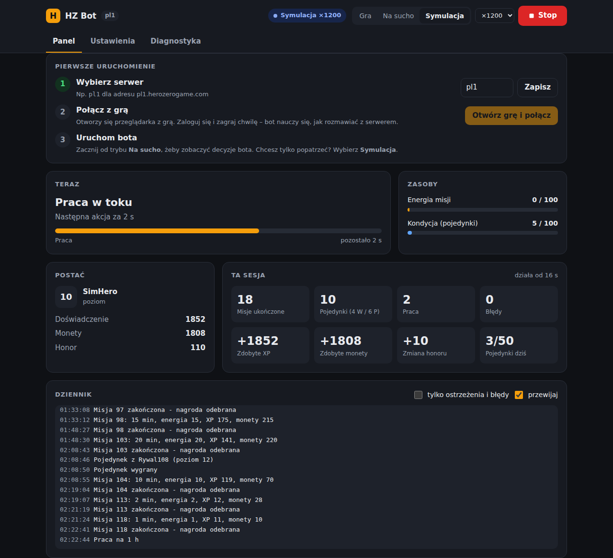

# hz-bot — bot do automatycznej gry w Hero Zero

Bot w Pythonie, który sam gra w [Hero Zero](https://www.herozerogame.com): wybiera i kończy
misje, toczy pojedynki, chodzi do pracy, odbiera nagrody. Komunikuje się bezpośrednio z API gry
(`request.php`) — nie klika w przeglądarce, więc działa szybko i może chodzić na serwerze 24/7.

> ⚠️ **Uwaga:** korzystanie z botów jest niezgodne z regulaminem Hero Zero i może skończyć się
> blokadą konta. Używasz na własne ryzyko — najlepiej najpierw na koncie testowym.

## Jak to działa

Klient gry wysyła żądania `POST https://<serwer>.herozerogame.com/request.php` z polami
`action`, `user_id`, `user_session_id`, `client_version`, … oraz podpisem
`auth = md5(action + sól + user_id)`. Serwer odpowiada JSON-em `{"data": {...}, "error": ""}`.

Sól i dokładne parametry są zaszyte w oficjalnym kliencie i mogą zmieniać się z wersjami gry,
dlatego bot **nie ma ich na sztywno**. Zamiast tego komenda `capture`:

1. otwiera grę w prawdziwej przeglądarce (Playwright), w której logujesz się normalnie,
2. przechwytuje żądania wysyłane przez grę i pobrane skrypty JS,
3. sama znajduje sól (sprawdza, który ciąg znaków z kodu gry odtwarza podpisy `auth`),
4. zapisuje sesję, stałe parametry (np. `client_version`), szablon logowania (bez hasła!)
   i listę zaobserwowanych akcji do `session.json`.

## Szybki start (panel w przeglądarce)



1. Zainstaluj [Pythona 3.10+](https://www.python.org/downloads/) (na Windows zaznacz „Add to PATH”).
2. Pobierz projekt i uruchom:
   - **Windows:** kliknij dwukrotnie `start.bat`
   - **Linux/macOS:** `./start.sh`

   Za pierwszym razem skrypt sam zainstaluje wszystko, czego potrzeba. Potem otworzy się panel
   pod adresem <http://127.0.0.1:8777>.
3. W panelu przejdź trzy kroki z karty **Pierwsze uruchomienie**:
   1. wpisz serwer (np. `pl1`),
   2. **połącz z grą** – patrz niżej,
   3. wybierz tryb **Na sucho** (bot tylko pokazuje decyzje) albo **Gra** i kliknij **Start**.

### Łączenie z grą (captcha „Nie jestem robotem”)

Bot musi raz podejrzeć ruch prawdziwej gry. Kliknij **Otwórz grę** w panelu:

1. Bot uruchamia **Twojego Chrome'a lub Edge** jako zwykły program, z osobnym profilem
   (`~/.hzbot/browser-profile`). Profil zapamiętuje logowanie na kolejne razy.
2. Logujesz się sam. Captcha działa normalnie, bo w tym czasie bot **nie jest podłączony**
   do przeglądarki i nie jest ona oznaczona jako sterowana automatycznie.
3. Klikasz **Zalogowałem się**. Dopiero wtedy bot podłącza się do przeglądarki tak jak
   narzędzia deweloperskie (F12) i nagrywa ruch gry.
4. Rozpoczynasz i odbierasz misję, stoczysz pojedynek, klikasz **Gotowe**. Okno się zamyka.

W terminalu to samo robi `python -m hzbot capture --server pl1`, a kolejne etapy
potwierdzasz klawiszem Enter.

Inne sposoby (w panelu: „Inne sposoby połączenia”):
- **Import pliku HAR.** W dowolnej przeglądarce: `F12` → **Sieć** → **Zachowaj log** → `F5`
  → zaloguj się i zagraj chwilę → **Eksportuj HAR**. Potem przeciągnij plik do panelu
  (albo `python -m hzbot import plik.har`) i usuń go, bo zawiera hasło i sesję.
- **Okno sterowane przez bota** (`capture --bot-browser`). Nie wymaga Chrome/Edge, ale jest
  oznaczone jako zautomatyzowane, więc captcha może się w nim nie zaliczyć.

Jeśli gra wymaga captcha przy logowaniu, bot nie zaloguje się sam po wygaśnięciu sesji.
Wtedy zatrzyma się z komunikatem i trzeba ponownie połączyć go z grą (zwykle wystarczy
**Otwórz grę** → **Zalogowałem się** → **Gotowe**, bo profil przeglądarki pamięta logowanie).

Panel pokazuje na żywo:
- co bot teraz robi, z odliczaniem do końca misji lub pracy,
- energię misji i kondycję, poziom, XP, monety i honor,
- statystyki sesji: misje, pojedynki (wygrane/przegrane), XP i monety zdobyte od startu,
- dziennik zdarzeń.

W zakładce **Ustawienia** zmienisz strategie, limity i godziny gry bez edytowania plików.
**Diagnostyka** pokazuje, czy nazwy akcji zgadzają się z tym, co wysyła gra, i pozwala
przetestować połączenie. Tryb **Symulacja** pozwala obejrzeć bota w akcji na wbudowanym
symulatorze (do ×1200 szybciej), bez łączenia z grą.

Panel działa tylko na Twoim komputerze (127.0.0.1). Inne strony internetowe nie mogą nim
sterować.

## Instalacja ręczna i wiersz poleceń

```bash
python -m venv .venv && source .venv/bin/activate    # Windows: .venv\Scripts\activate
pip install -e ".[capture]"
playwright install chromium
python -m hzbot                                      # panel (to samo co: python -m hzbot app)
```

Wszystko, co robi panel, jest też dostępne z terminala:

```bash
cp config.example.yaml config.yaml                   # i ustaw swój serwer (np. pl1)
python -m hzbot import zapis.har                     # połączenie z grą z pliku HAR
python -m hzbot capture --server pl1                 # albo: Twoja przeglądarka (Enter po każdym etapie)
python -m hzbot doctor --ping                        # diagnostyka
python -m hzbot run --dry-run                        # na sucho
python -m hzbot run                                  # gra
```

| Komenda | Opis |
| --- | --- |
| `app [--port 8777] [--no-browser]` | panel w przeglądarce (domyślna komenda) |
| `simulate --hours 24` | bot na symulatorze, wynik w terminalu |
| `call AKCJA k=v …` | wysyła pojedynczą akcję i wypisuje odpowiedź (debugowanie) |
| `login` | loguje ponownie e-mailem/hasłem z konfiguracji (`HZ_EMAIL`, `HZ_PASSWORD`) |

Jeśli diagnostyka pokazuje „Nie widziano” przy jakiejś akcji, wykonaj ją ręcznie w grze podczas
kolejnego łączenia (wyniki z wielu połączeń się sumują) albo popraw nazwę w Ustawienia →
Zaawansowane (sekcja `actions:` w `config.yaml`).

## Co robi bot

W pętli, z losowymi przerwami między akcjami:

1. **Misja w toku** → czeka do jej końca, sprawdza ukończenie i odbiera nagrodę.
2. **Praca w toku** → czeka do końca i odbiera wypłatę.
3. **Pojedynki** → gdy jest kondycja i nie przekroczono dziennego limitu: pobiera listę rywali,
   wybiera wg strategii (`weakest` lub `honor`), walczy i odbiera nagrodę. Nie walczy dwa razy
   tego samego dnia z tym samym rywalem.
4. **Nowa misja** → wybiera najlepszą dostępną wg strategii (`xp_per_energy`,
   `coins_per_energy`, `xp_per_minute`, `coins_per_minute`, `balanced`), z uwzględnieniem
   rezerwy energii, maks. czasu trwania, pomijania walk i preferowania przedmiotów.
5. **Praca** (opcjonalnie) → gdy nie ma nic innego do zrobienia.
6. Inaczej czeka `idle_poll_minutes` i sprawdza stan ponownie.

Dodatkowo: godziny aktywności (`active_hours`), limit czasu działania, automatyczne ponowne
logowanie po wygaśnięciu sesji, ponawianie przy błędach sieci i zatrzymanie po serii błędów.
Po zakończeniu (także Ctrl+C) wypisuje podsumowanie. Wszystkie opcje opisuje
[`config.example.yaml`](config.example.yaml).

## Struktura

```
hzbot/
  auth.py      podpis md5 i wykrywanie soli z kodu JS
  capture.py   przechwytywanie protokołu z przeglądarki (Playwright)
  har.py       import protokołu z pliku HAR z Twojej przeglądarki
  client.py    klient request.php (podpisy, ponawianie, błędy, dry-run)
  session.py   plik sesji
  state.py     lokalny stan gry składany z odpowiedzi serwera
  strategy.py  wybór misji i przeciwników
  bot.py       główna pętla
  sim.py       symulator serwera gry (testy, `simulate`)
  config.py    konfiguracja YAML
  cli.py       komendy
  app.py       serwer panelu (biblioteka standardowa)
  web/         interfejs panelu (jeden plik HTML, bez zależności)
tests/         pytest (w tym pełna doba gry na symulatorze)
```

## Testy

```bash
pip install -e ".[dev]"
pytest
```

## Ograniczenia

- Nazwy akcji i pól odpowiedzi pochodzą z publicznie dostępnych informacji o protokole i nie
  były testowane na żywym serwerze — po aktualizacji gry mogą wymagać poprawek w `actions:`.
  Bot czyta pola odpowiedzi defensywnie (np. `quest_energy`, `duel_stamina`,
  `active_quest_id`, `ts_complete`), a nieznane pola ignoruje.
- Jeśli gra zacznie wysyłać parametr zmieniający się z każdym żądaniem, `capture` wypisze
  ostrzeżenie — taki parametr trzeba wtedy obsłużyć w kodzie.
- `session.json` zawiera aktywną sesję konta — nie udostępniaj go (jest w `.gitignore`).
